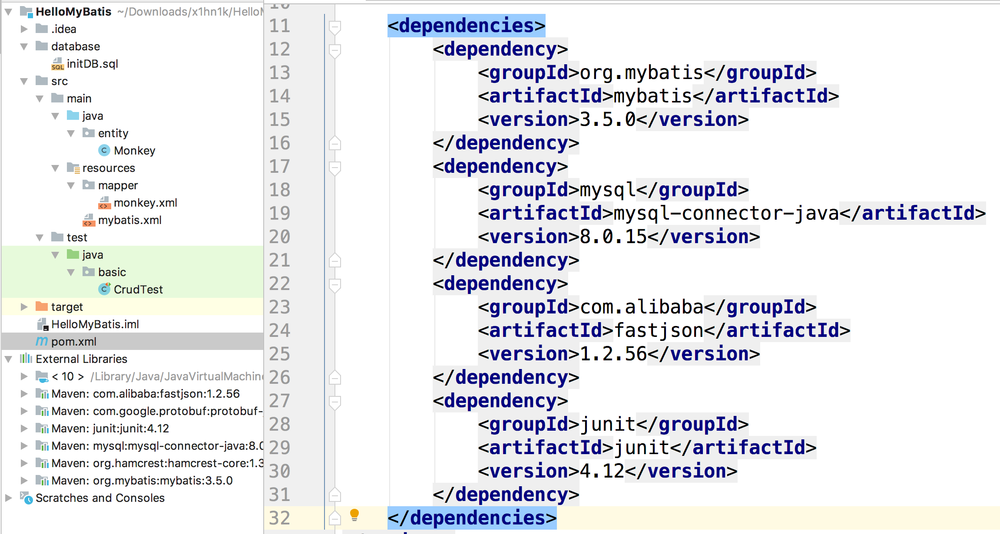
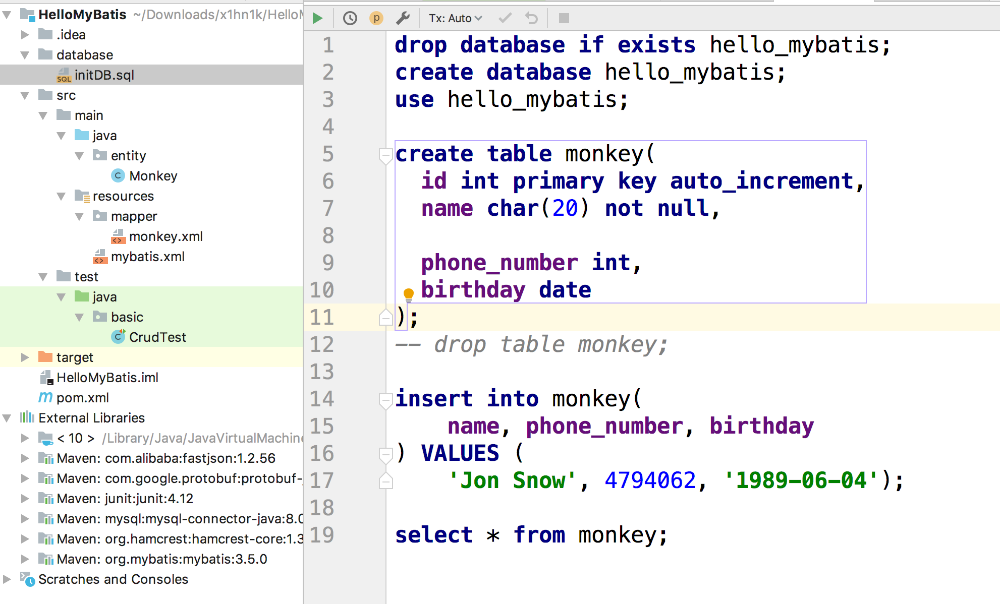
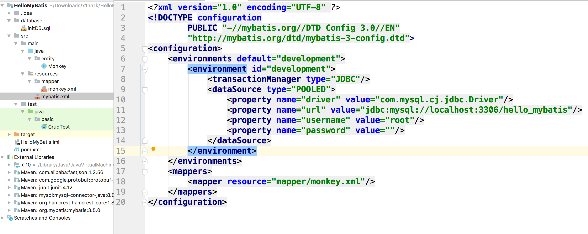
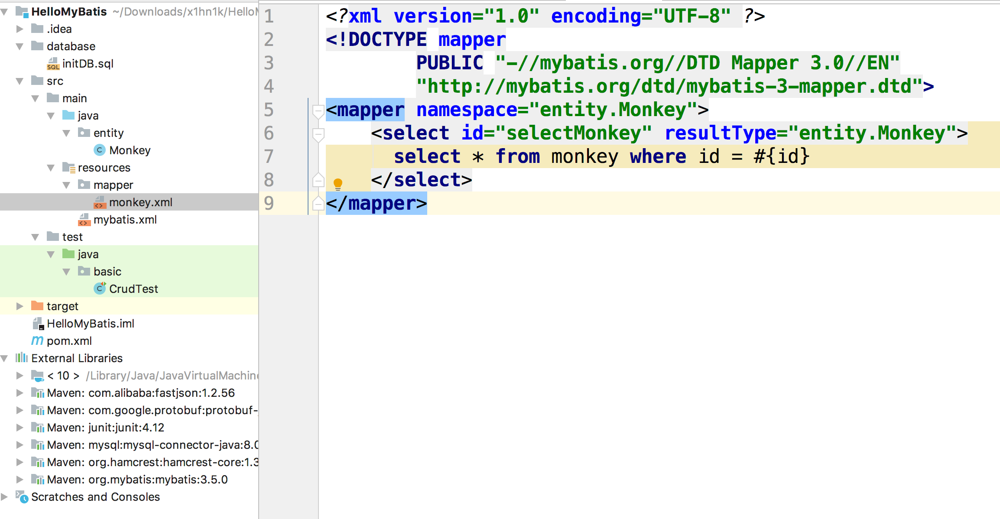
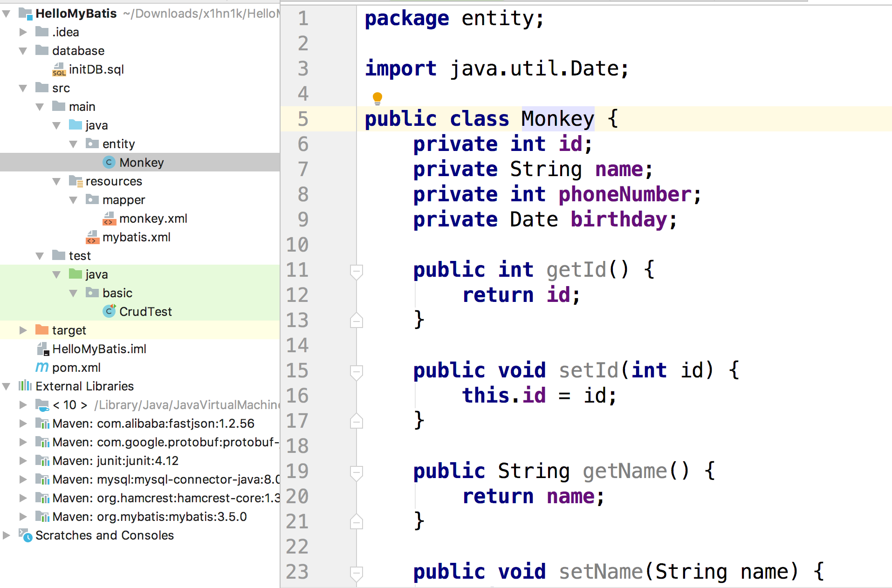
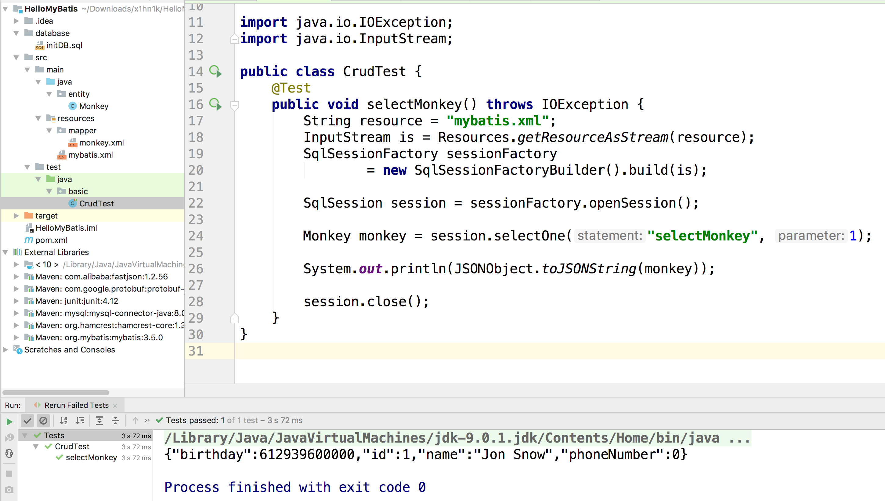

## 搭建开发环境

1. 创建maven工程，添加相关依赖
2. 初始化数据可
3. 创建配置文件
4. 在代码中创建sessionFactory，使用它


#### 依赖文件

在pom中引入MyBatis的依赖就行了，这里我用了作为数据库。

```xml
    <dependencies>
        <dependency>
            <groupId>org.mybatis</groupId>
            <artifactId>mybatis</artifactId>
            <version>3.5.0</version>
        </dependency>
        <dependency>
            <groupId>mysql</groupId>
            <artifactId>mysql-connector-java</artifactId>
            <version>8.0.15</version>
        </dependency>
        <dependency>
            <groupId>com.alibaba</groupId>
            <artifactId>fastjson</artifactId>
            <version>1.2.56</version>
        </dependency>
        <dependency>
            <groupId>junit</groupId>
            <artifactId>junit</artifactId>
            <version>4.12</version>
        </dependency>
    </dependencies>
```



#### 初始化数据库

我们可以先简单的初始化下数据库，方便后续操作，这里我创建了一个新的数据库，然后创建了monkey这个表。

```sql
drop database if exists hello_mybatis;
create database hello_mybatis;
use hello_mybatis;

create table monkey(
  id int primary key auto_increment,
  name char(20) not null,

  phone_number int,
  birthday date
);
-- drop table monkey;

insert into monkey(
    name, phone_number, birthday
) VALUES (
    'Jon Snow', 4794062, '1989-06-04');

select * from monkey;
```



#### 配置文件

``` xml
<?xml version="1.0" encoding="UTF-8" ?>
<!DOCTYPE configuration
        PUBLIC "-//mybatis.org//DTD Config 3.0//EN"
        "http://mybatis.org/dtd/mybatis-3-config.dtd">
<configuration>
    <environments default="development">
        <environment id="development">
            <transactionManager type="JDBC"/>
            <dataSource type="POOLED">
                <property name="driver" value="com.mysql.cj.jdbc.Driver"/>
                <property name="url" value="jdbc:mysql://localhost:3306/hello_mybatis"/>
                <property name="username" value="root"/>
                <property name="password" value=""/>
            </dataSource>
        </environment>
    </environments>
    <mappers>
        <mapper resource="mapper/monkey.xml"/>
    </mappers>
</configuration>
```



配置文件主要是告诉我们数据库的基本信息。文件名可以随意，到时候在代码中指定对应的目录就行了。

然后我们要通过配置environment来告知MyBatis我们数据库的信息。


```xml
<?xml version="1.0" encoding="UTF-8" ?>
<!DOCTYPE mapper
        PUBLIC "-//mybatis.org//DTD Mapper 3.0//EN"
        "http://mybatis.org/dtd/mybatis-3-mapper.dtd">
<mapper namespace="entity.Monkey">
    <select id="selectMonkey" resultType="entity.Monkey">
      select * from monkey where id = #{id}
    </select>
</mapper>
```



真正的配置我们的SQL语句，每个语句就想bean一样有自己的ID

#### 实体类



我们要把我们的实体对象和数据库中的字段做出映射


#### 运行测试

``` java
public class CrudTest {
    @Test
    public void selectMonkey() throws IOException {
        String resource = "mybatis.xml";
        InputStream is = Resources.getResourceAsStream(resource);
        SqlSessionFactory sessionFactory
                = new SqlSessionFactoryBuilder().build(is);

        SqlSession session = sessionFactory.openSession();

        Monkey monkey = session.selectOne("selectMonkey", 1);

        System.out.println(JSONObject.toJSONString(monkey));

        session.close();
    }
}
```





- 创建工厂
- 执行我们在配置文件里面写的SQL语句
- 关闭