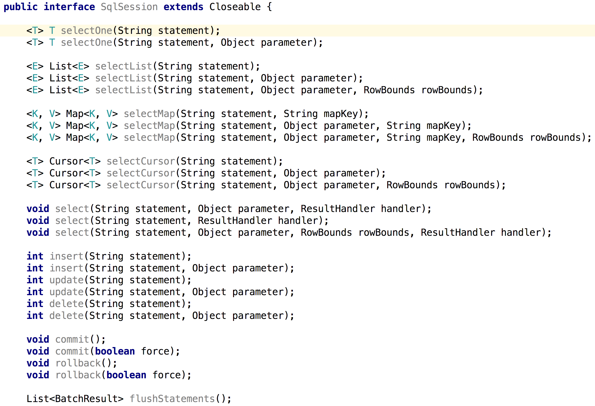
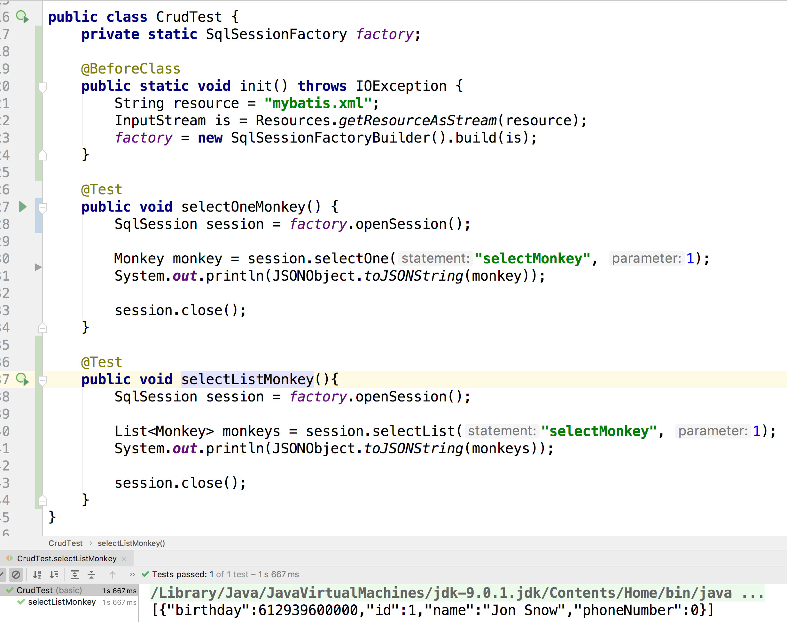
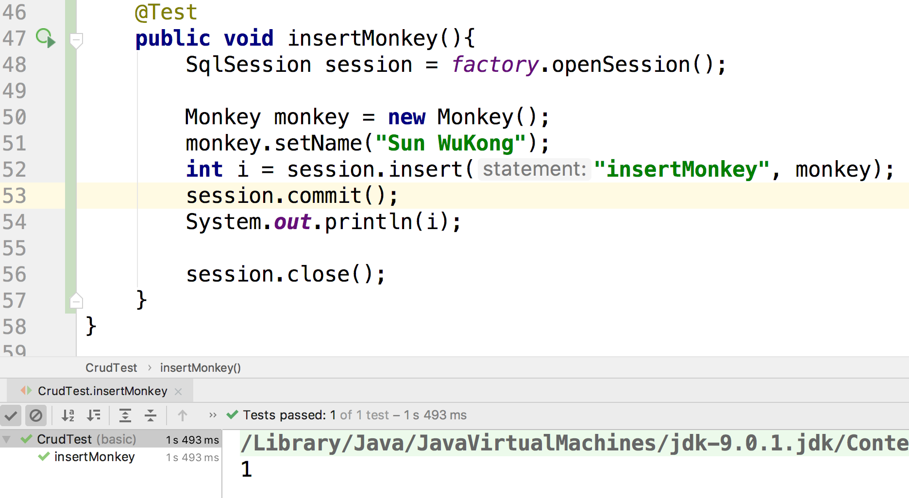
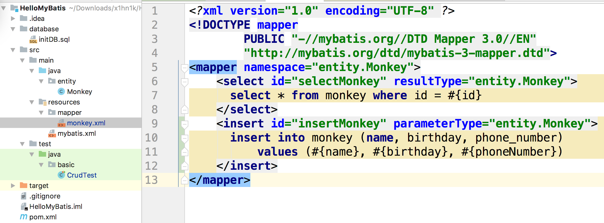

### 通过session来执行xml中配置的SQL语句

就想我们之前说的，session就是帮我们做增删改查的，所以它有下面五个方法

- selectOne
- selectList
- insert
- upodate
- delete

这个不用说了，基本操作。就是select语句我们知道，有时候我们只要一条数据，有时候我们需要结果集，所以它对应了两条数据。

然后每一个方法都可能接受下面的参数：

- statement id： 这个就是选取到我们在配置文件中对应的sql语句
- object parmas ： 我们要给这个SQL语句传递哪些参数呢？请看这里


下面是它源码中定义的接口。




### selectList

和selectOne区别在于返回一个List




### insert

```xml
    <insert id="insertMonkey" parameterType="entity.Monkey">
      insert into monkey (name, birthday, phone_number)
          values (#{name}, #{birthday}, #{phoneNumber})
    </insert>
```

如果参数是一个对象，那么它的表现和基本数据类型是不一样的，会结构我们的对象，然后把它们给拿出来作为参数传递进去




注意需要提交commit,然后



## SqlSession

这里是SqlSession的源代码

```java
/**
 * The primary Java interface for working with MyBatis.
 * Through this interface you can execute commands, get mappers and manage transactions.
 *
 * @author Clinton Begin
 */
public interface SqlSession extends Closeable {

    /**
     * Retrieve a single row mapped from the statement key
     * @param <T> the returned object type
     * @param statement
     * @return Mapped object
     */
    <T> T selectOne(String statement);

    /**
     * Retrieve a single row mapped from the statement key and parameter.
     * @param <T> the returned object type
     * @param statement Unique identifier matching the statement to use.
     * @param parameter A parameter object to pass to the statement.
     * @return Mapped object
     */
    <T> T selectOne(String statement, Object parameter);

    /**
     * Retrieve a list of mapped objects from the statement key and parameter.
     * @param <E> the returned list element type
     * @param statement Unique identifier matching the statement to use.
     * @return List of mapped object
     */
    <E> List<E> selectList(String statement);

    /**
     * Retrieve a list of mapped objects from the statement key and parameter.
     * @param <E> the returned list element type
     * @param statement Unique identifier matching the statement to use.
     * @param parameter A parameter object to pass to the statement.
     * @return List of mapped object
     */
    <E> List<E> selectList(String statement, Object parameter);

    /**
     * Retrieve a list of mapped objects from the statement key and parameter,
     * within the specified row bounds.
     * @param <E> the returned list element type
     * @param statement Unique identifier matching the statement to use.
     * @param parameter A parameter object to pass to the statement.
     * @param rowBounds  Bounds to limit object retrieval
     * @return List of mapped object
     */
    <E> List<E> selectList(String statement, Object parameter, RowBounds rowBounds);

    /**
     * The selectMap is a special case in that it is designed to convert a list
     * of results into a Map based on one of the properties in the resulting
     * objects.
     * Eg. Return a of Map[Integer,Author] for selectMap("selectAuthors","id")
     * @param <K> the returned Map keys type
     * @param <V> the returned Map values type
     * @param statement Unique identifier matching the statement to use.
     * @param mapKey The property to use as key for each value in the list.
     * @return Map containing key pair data.
     */
    <K, V> Map<K, V> selectMap(String statement, String mapKey);

    /**
     * The selectMap is a special case in that it is designed to convert a list
     * of results into a Map based on one of the properties in the resulting
     * objects.
     * @param <K> the returned Map keys type
     * @param <V> the returned Map values type
     * @param statement Unique identifier matching the statement to use.
     * @param parameter A parameter object to pass to the statement.
     * @param mapKey The property to use as key for each value in the list.
     * @return Map containing key pair data.
     */
    <K, V> Map<K, V> selectMap(String statement, Object parameter, String mapKey);

    /**
     * The selectMap is a special case in that it is designed to convert a list
     * of results into a Map based on one of the properties in the resulting
     * objects.
     * @param <K> the returned Map keys type
     * @param <V> the returned Map values type
     * @param statement Unique identifier matching the statement to use.
     * @param parameter A parameter object to pass to the statement.
     * @param mapKey The property to use as key for each value in the list.
     * @param rowBounds  Bounds to limit object retrieval
     * @return Map containing key pair data.
     */
    <K, V> Map<K, V> selectMap(String statement, Object parameter, String mapKey, RowBounds rowBounds);

    /**
     * A Cursor offers the same results as a List, except it fetches data lazily using an Iterator.
     * @param <T> the returned cursor element type.
     * @param statement Unique identifier matching the statement to use.
     * @return Cursor of mapped objects
     */
    <T> Cursor<T> selectCursor(String statement);

    /**
     * A Cursor offers the same results as a List, except it fetches data lazily using an Iterator.
     * @param <T> the returned cursor element type.
     * @param statement Unique identifier matching the statement to use.
     * @param parameter A parameter object to pass to the statement.
     * @return Cursor of mapped objects
     */
    <T> Cursor<T> selectCursor(String statement, Object parameter);

    /**
     * A Cursor offers the same results as a List, except it fetches data lazily using an Iterator.
     * @param <T> the returned cursor element type.
     * @param statement Unique identifier matching the statement to use.
     * @param parameter A parameter object to pass to the statement.
     * @param rowBounds  Bounds to limit object retrieval
     * @return Cursor of mapped objects
     */
    <T> Cursor<T> selectCursor(String statement, Object parameter, RowBounds rowBounds);

    /**
     * Retrieve a single row mapped from the statement key and parameter
     * using a {@code ResultHandler}.
     * @param statement Unique identifier matching the statement to use.
     * @param parameter A parameter object to pass to the statement.
     * @param handler ResultHandler that will handle each retrieved row
     */
    void select(String statement, Object parameter, ResultHandler handler);

    /**
     * Retrieve a single row mapped from the statement
     * using a {@code ResultHandler}.
     * @param statement Unique identifier matching the statement to use.
     * @param handler ResultHandler that will handle each retrieved row
     */
    void select(String statement, ResultHandler handler);

    /**
     * Retrieve a single row mapped from the statement key and parameter
     * using a {@code ResultHandler} and {@code RowBounds}
     * @param statement Unique identifier matching the statement to use.
     * @param rowBounds RowBound instance to limit the query results
     * @param handler ResultHandler that will handle each retrieved row
     */
    void select(String statement, Object parameter, RowBounds rowBounds, ResultHandler handler);

    /**
     * Execute an insert statement.
     * @param statement Unique identifier matching the statement to execute.
     * @return int The number of rows affected by the insert.
     */
    int insert(String statement);

    /**
     * Execute an insert statement with the given parameter object. Any generated
     * autoincrement values or selectKey entries will modify the given parameter
     * object properties. Only the number of rows affected will be returned.
     * @param statement Unique identifier matching the statement to execute.
     * @param parameter A parameter object to pass to the statement.
     * @return int The number of rows affected by the insert.
     */
    int insert(String statement, Object parameter);

    /**
     * Execute an update statement. The number of rows affected will be returned.
     * @param statement Unique identifier matching the statement to execute.
     * @return int The number of rows affected by the update.
     */
    int update(String statement);

    /**
     * Execute an update statement. The number of rows affected will be returned.
     * @param statement Unique identifier matching the statement to execute.
     * @param parameter A parameter object to pass to the statement.
     * @return int The number of rows affected by the update.
     */
    int update(String statement, Object parameter);

    /**
     * Execute a delete statement. The number of rows affected will be returned.
     * @param statement Unique identifier matching the statement to execute.
     * @return int The number of rows affected by the delete.
     */
    int delete(String statement);

    /**
     * Execute a delete statement. The number of rows affected will be returned.
     * @param statement Unique identifier matching the statement to execute.
     * @param parameter A parameter object to pass to the statement.
     * @return int The number of rows affected by the delete.
     */
    int delete(String statement, Object parameter);

    /**
     * Flushes batch statements and commits database connection.
     * Note that database connection will not be committed if no updates/deletes/inserts were called.
     * To force the commit call {@link org.apache.ibatis.session.SqlSession#commit(boolean)}
     */
    void commit();

    /**
     * Flushes batch statements and commits database connection.
     * @param force forces connection commit
     */
    void commit(boolean force);

    /**
     * Discards pending batch statements and rolls database connection back.
     * Note that database connection will not be rolled back if no updates/deletes/inserts were called.
     * To force the rollback call {@link org.apache.ibatis.session.SqlSession#rollback(boolean)}
     */
    void rollback();

    /**
     * Discards pending batch statements and rolls database connection back.
     * Note that database connection will not be rolled back if no updates/deletes/inserts were called.
     * @param force forces connection rollback
     */
    void rollback(boolean force);

    /**
     * Flushes batch statements.
     * @return BatchResult list of updated records
     * @since 3.0.6
     */
    List<BatchResult> flushStatements();

    /**
     * Closes the session
     */
    @Override
    void close();

    /**
     * Clears local session cache
     */
    void clearCache();

    /**
     * Retrieves current configuration
     * @return Configuration
     */
    Configuration getConfiguration();

    /**
     * Retrieves a mapper.
     * @param <T> the mapper type
     * @param type Mapper interface class
     * @return a mapper bound to this SqlSession
     */
    <T> T getMapper(Class<T> type);

    /**
     * Retrieves inner database connection
     * @return Connection
     */
    Connection getConnection();
}

```

